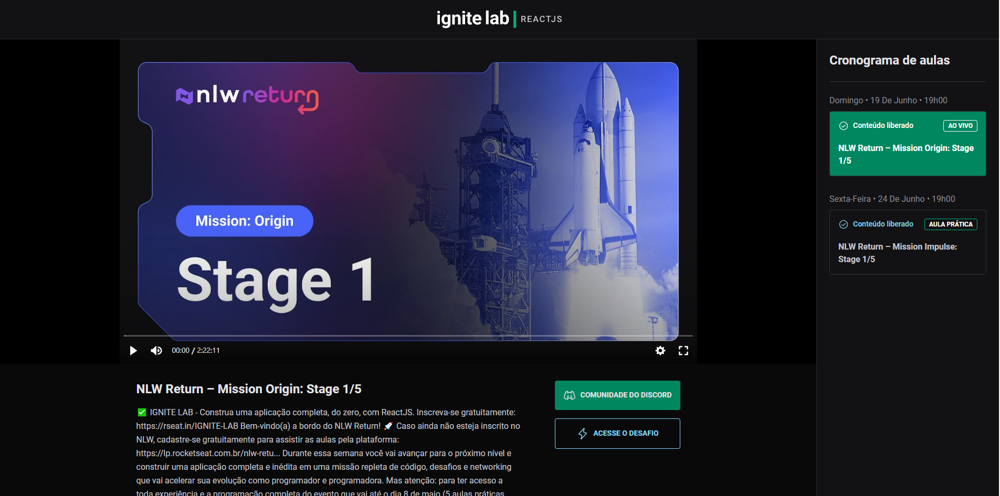

<h1 align="center">Event Platform</h1>

<h1 align="center">
    
</h1>

<h2 align="center">Live Demo: https://event-platform-ignite-lab-ashen.vercel.app/ </h2>

## 💻 Project

Uma plataforma de aulas criado no Ignite lab da Rocketseat.

Este app faz queries no CMS do GraphQL.

## 🚀 Techs

This project was built with:

 [Vite](https://vitejs.dev/)
 
 
 [React](https://reactjs.org) 
 
 
 [Next](https://nextjs.org/)
 
 
 [Tailwind CSS](https://tailwindcss.com/) 
 
 
 [GraphQL](https://graphql.org/)
